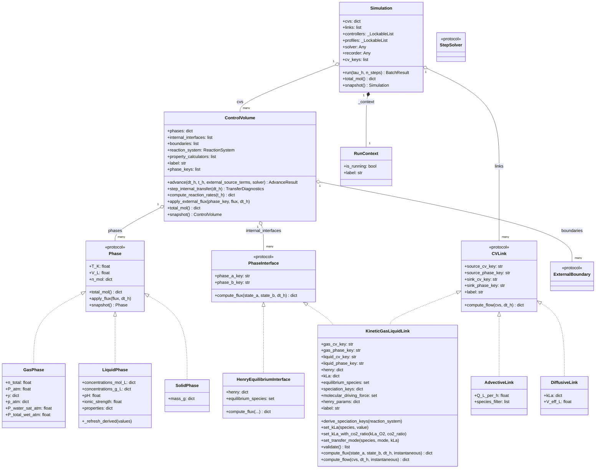
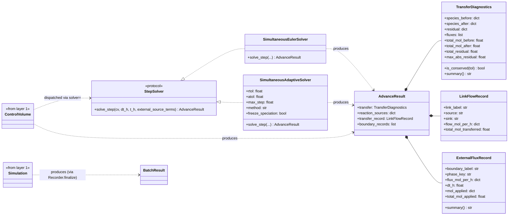
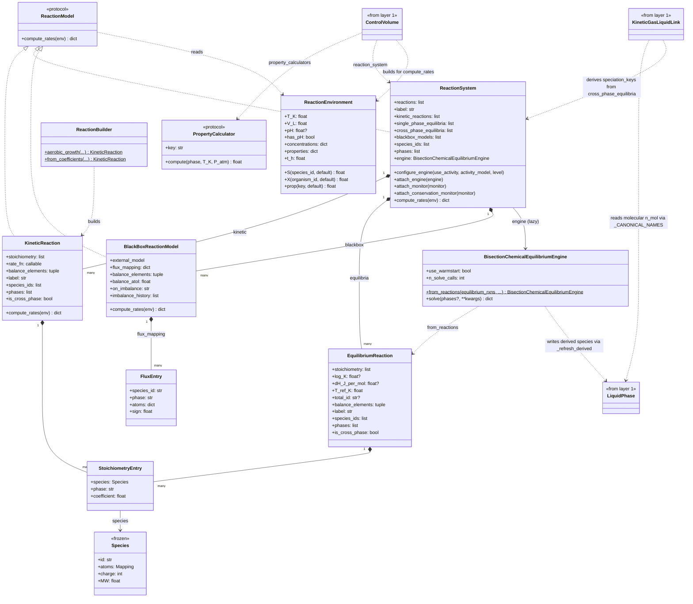
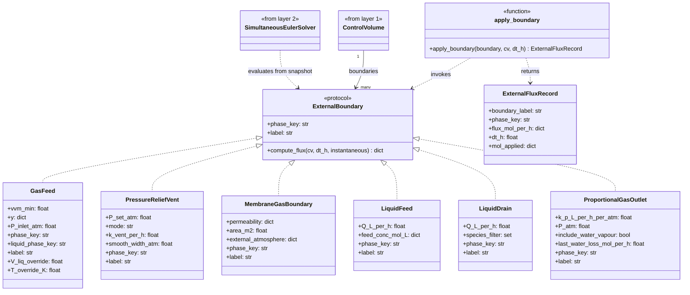
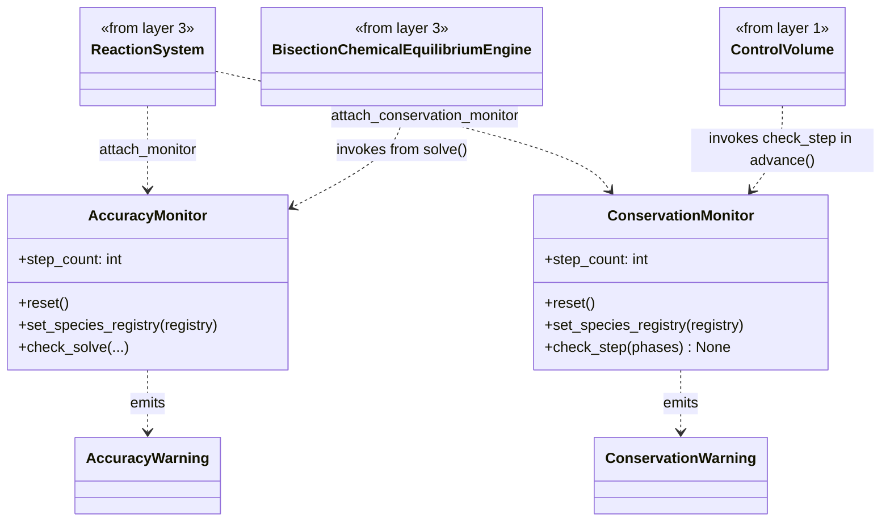

# Class Diagrams

Four interface-level UML class diagrams covering the post-Phase-7 core
of PyOMES. Each layer is a separate diagram so the picture stays
readable; classes that span layers (e.g. `KineticGasLiquidLink`,
`ExternalBoundary`) appear in whichever layer they primarily belong
and are referenced by name in the others.

The four layers reflect the architectural framing in
[CONTAINER_LAYERING.md](phases-upcoming/CONTAINER_LAYERING.md):

1. **Topology and containers** — how state is decomposed in space.
2. **Integration / time-stepping** — how time advances.
3. **Properties and reactions** — chemistry-flavoured plug-ins.
4. **External boundaries** — fluxes across the system edge.

Each diagram is **interface-level**: class names, key public
attributes, and key public methods, plus the relationships between
them. Private helpers and one-off utility methods are omitted to
keep the diagrams readable.

The diagrams render natively in GitHub, VS Code's markdown preview,
and most modern markdown viewers via the Mermaid `classDiagram`
syntax. No external tools required.

---

## 1 — Topology and containers

How state is decomposed in space, and what holds it together.
`Phase` is the leaf state; `ControlVolume` aggregates phases,
internal interfaces, external `boundaries`, the
`reaction_system` (chemistry), and the optional list of
`property_calculators` (scalar derived properties). A fermenter
is a plain `ControlVolume` with `{"gas", "liquid"}` phases plus
a `KineticGasLiquidLink` as an internal interface —
`GasLiquidVolume` was deleted in Phase 7. `Simulation` (shipped
in `simulation-class` 2026-05-27) is the single orchestration
class — it owns the dict of CVs, the inter-CV link list,
controllers, profiles, and dispatches a per-CV `StepSolver`
through its `solver=` parameter. The legacy `MultiCVSystem` was
deleted at C14 of that phase.

State-unification (2026-05-21) collapsed the speciation-side
type machinery: `cv.advance(dt_h, t_h)` replaces the legacy
`(dt_h, chem_env)` signature; derived species (`H+`, `OH-`,
`CO2aq`, `HCO3-`, `NH3`, `NH4+`, strong ions) live directly in
`phase.n_mol`; pH derives from `n_mol["H+"]`. The
`KineticGasLiquidLink` reads alphas inline from `phase.n_mol`
ratios — no `PropertyResult.alphas` channel.

### Relationship key

- `<|--` solid arrow with hollow head — class inheritance.
- `<|..` dashed arrow with hollow head — protocol implementation.
- `*--` solid line with filled diamond — composition (lifecycle ownership).
- `o--` solid line with hollow diamond — aggregation (uses, doesn't own lifecycle).
- `-->` solid arrow — association (holds reference).

---

## 2 — Integration / time-stepping

How a single timestep advances. `StepSolver` strategies operate on a
`ControlVolume` directly (snapshot or adaptive) and are dispatched
via `cv.advance(solver=...)`; the default sequential body of
`ControlVolume.advance()` integrates the reaction sub-step with a
single forward Euler evaluation (no pluggable inner integrator).
The diagnostic dataclasses on the right are what each path returns
to the orchestrator — Phase 6 unified the old
`GasLiquidAdvanceResult` into the single `AdvanceResult`, which
carries `transfer_record` and `boundary_records`.

See [docs/solvers.md](solvers.md) for the semantics of each
`StepSolver`.

---

## 3 — Properties and reactions

Two narrow chemistry-flavoured plug-ins on the CV. **Property
calculators** compute one scalar derived property each (viscosity,
density, …) and write it to `phase.properties[key]`. **The reaction
system** holds every reaction declaration on the CV and pre-buckets
them by isinstance at construction so each one routes to the right
consumer. Speciation (acid-base equilibria) is *not* a property —
the engine writes derived molecular species straight back into
`phase.n_mol`, sharing one canonical store with the kinetic
sub-step.

`KineticGasLiquidLink` reads the molecular fraction it needs for the
speciation-corrected Henry constant directly from
`liquid.n_mol[mol_key]` (resolved via `_CANONICAL_NAMES` against the
gas key), then divides by the canonical total — the speciation
engine has already populated both for the current step.

> **State as of `state-unification` (2026-05-22, shipped).** This
> phase collapsed the speciation-shaped type machinery left over
> from earlier rounds. `PropertySolver` / `PropertyResult` /
> `SpeciationPropertySolver` are deleted; their slot is taken by
> the narrow [`PropertyCalculator`](../PyOMES/core/property_calculator.py)
> protocol (one `key: str`, one `compute(phase, T_K, P_atm) -> float`,
> no `chem_env`, no result struct). The unified `Reaction` class
> with `kind=` branching is replaced by three independent
> declaration classes:
> [`KineticReaction`](../PyOMES/reactions/kinetic.py),
> [`EquilibriumReaction`](../PyOMES/reactions/equilibrium.py), and
> [`BlackBoxReactionModel`](../PyOMES/reactions/blackbox.py) — no
> shared base, shared validation lives as free functions in
> `_shared.py`. `ReactionSet` is replaced by
> [`ReactionSystem`](../PyOMES/reactions/reaction_system.py), which
> pre-buckets reactions into `_kinetic_reactions`,
> `_single_phase_equilibria`, `_cross_phase_equilibria`, and
> `_blackbox_models` at `__init__`. `cv.reaction_system` is the
> single attach point (the old `cv.reaction_model` is gone);
> `cv.property_solvers` becomes `cv.property_calculators`. The
> system lazily builds its `BisectionChemicalEquilibriumEngine` on first access, and
> the engine writes derived species (`CO2aq`, `NH3`, `HAc`, …)
> straight to `phase.n_mol` via the privileged
> `phase._refresh_derived(values)` hook — eliminating the
> `PropertyResult.alphas` channel and the dict-of-dicts plumbing
> that fed it. `chem_env` is deleted system-wide;
> `cv.advance(dt_h, t_h)` is the new entry signature.
>
> Monitoring is attached on the same surface: an
> [`AccuracyMonitor`](../PyOMES/monitoring/accuracy.py) hooks engine
> internals via `cv.reaction_system.attach_monitor(monitor)`, and a
> [`ConservationMonitor`](../PyOMES/monitoring/conservation.py) (new
> in C6) checks element + charge balance per step via
> `cv.reaction_system.attach_conservation_monitor(monitor)`. The CV
> auto-attaches a default `ConservationMonitor` in `__init__` and
> populates its species registry from the reaction stoichiometries.
>
> **Still deferred:** retirement of the engine `level` parameter
> (currently legacy default `level=2`, hidden behind
> `configure_engine`) — folds into the future
> `ChemistryDatabase` track. See
> [phases-upcoming/SPECIATION_LEVEL_RETIREMENT.md](phases-upcoming/SPECIATION_LEVEL_RETIREMENT.md).

---

## 4 — External boundaries

State-dependent fluxes across the system edge. `ExternalBoundary`
is a runtime-checkable protocol, not a base class — implementations
just need `phase_key`, `label`, and
`compute_flux(cv, dt_h, instantaneous)`.  The boundaries layer is
where feed schedules, vents, membranes, and controller-driven dosing
get plugged in.  `apply_boundary` is a free-function helper that
invokes a boundary against a CV and returns the diagnostic record.

---

## 5 — Monitoring

Two per-CV monitors attached on the `ReactionSystem` surface watch
the speciation + integration path for drift. Both share a throttle
plumbing (`once` / `first_N` / `always` / `silent`) configured via
`PyOMES.config.warnings`, and both expose a module-level summary
counter for end-of-run reporting.

- [`AccuracyMonitor`](../PyOMES/monitoring/accuracy.py) — emitted from
  inside the `BisectionChemicalEquilibriumEngine` solve loop when the Newton residual,
  charge balance, or iteration count exceeds the configured
  thresholds. Attached via
  `cv.reaction_system.attach_monitor(monitor)`; the system
  propagates the monitor to the engine on first build.
- [`ConservationMonitor`](../PyOMES/monitoring/conservation.py)
  (state-unification C6) — invoked once per
  `ControlVolume.advance` step. Tracks element totals and net
  charge across all phases; emits a `ConservationWarning` when
  drift exceeds the per-step or cumulative threshold. The species
  registry (`{species_id: Species}`) is populated automatically by
  `ControlVolume.__init__` from the reaction stoichiometries.

---

## How to use these diagrams

- **Reading a new piece of code:** start in layer 1 to see where it
  fits structurally, then drill into 2/3/4 for the specific machinery.
- **Adding a new unit:** layers 1 and 4 are usually what you touch.
  Build a `ControlVolume` with the right phases, internal interfaces,
  and boundaries (the fermenter pattern is `{"gas", "liquid"}` phases
  plus a `KineticGasLiquidLink`).
- **Adding a new integration strategy:** layer 2 — implement the
  `StepSolver` protocol (operating on a `ControlVolume`) and pass it
  via `cv.advance(solver=...)` or
  `Simulation(cvs=..., solver={cv_key: solver}).run(...)`.
- **Adding a new chemistry plug-in:** layer 3 — implement
  `PropertyCalculator` (one scalar value, `phase.properties[key]`)
  or contribute a reaction declaration (`KineticReaction`,
  `EquilibriumReaction`, or `BlackBoxReactionModel`) to a
  `ReactionSystem`.

Diagrams are kept at interface-level deliberately: private helpers
(`_clamp_deltas`, `_build_reaction_environment`,
`_SnapshotCV`, etc.) are implementation detail and would clutter
the picture. Read the source for those; the diagrams are the
**contract** view.

---

## Maintenance

These diagrams are hand-curated, not auto-generated. They will drift
if the code changes and no one updates them. When making a change
that affects a class's public surface (new protocol method, renamed
attribute, new wrapper class, removed method), update the relevant
layer here in the same PR. The diagrams are short — touching them
is cheap.

Out of scope for these diagrams (intentionally):

- The `PyOMES/chemistry/` package (compounds, registry, `EquilibriumSet`,
  `ThermodynamicConfig`).
- The `PyOMES/chemical_equilibrium/` engine internals (`Level1`, `Level2`,
  `Level2_5`, `StrongIonsSolver`).
- The `PyOMES/control/` package (`ControlSystem`, `PIController`,
  actuators).
- The `models/vlmodels/` packages (fermenter unit, ADM1, HPLC).
- The `PyOMES/numerics/` package (advection / dispersion schemes).

If a future phase pulls any of those into the architectural picture,
add a new layer rather than expanding an existing one — the
[CONTAINER_LAYERING.md](phases-upcoming/CONTAINER_LAYERING.md) framing argues for
keeping concerns separable.
