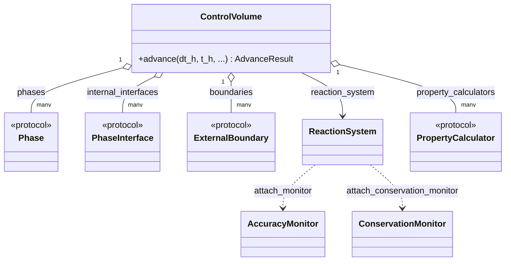
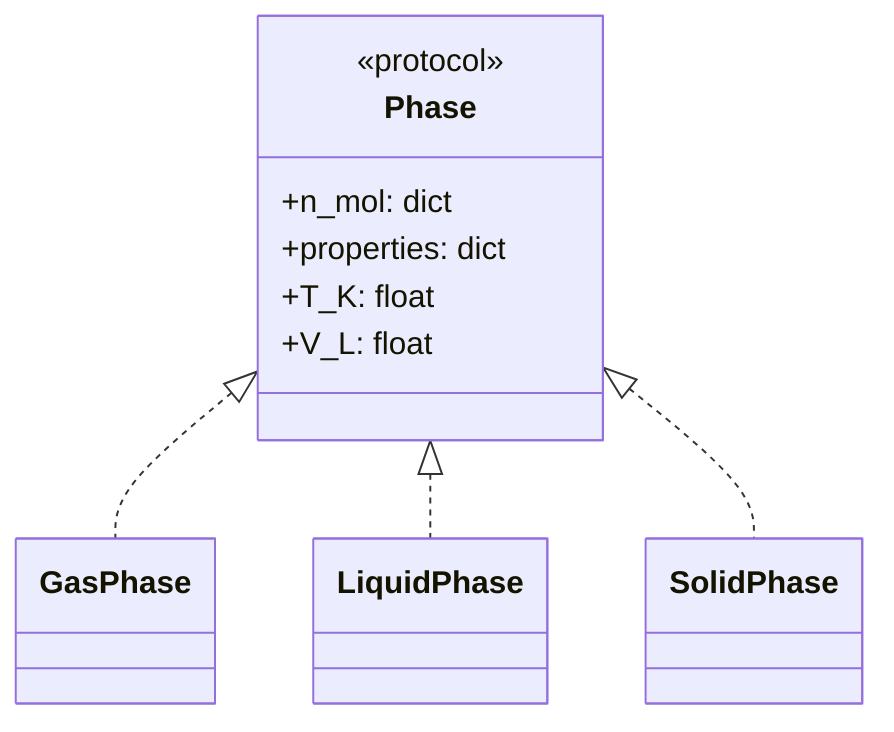
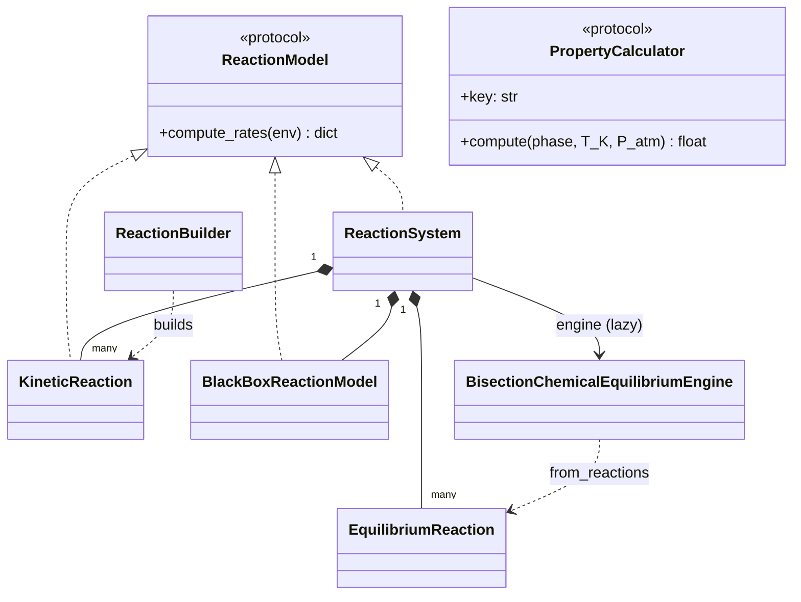
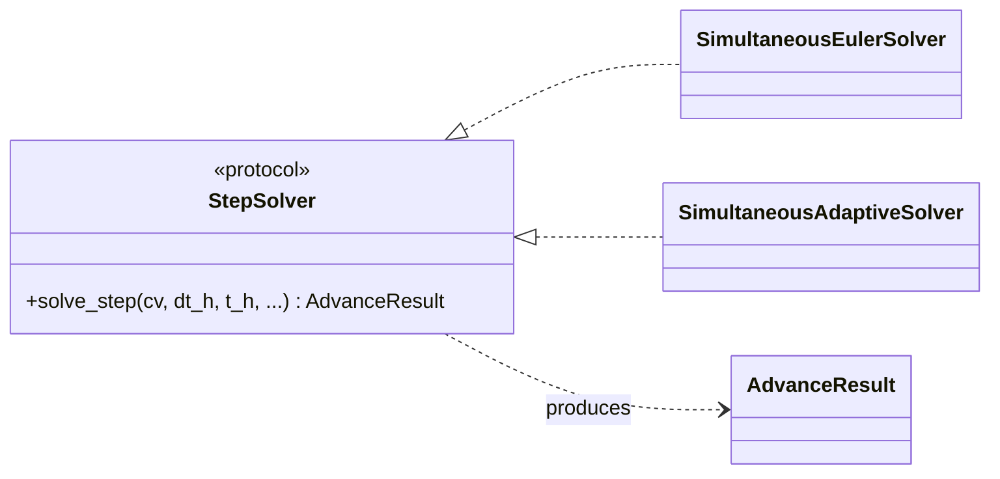
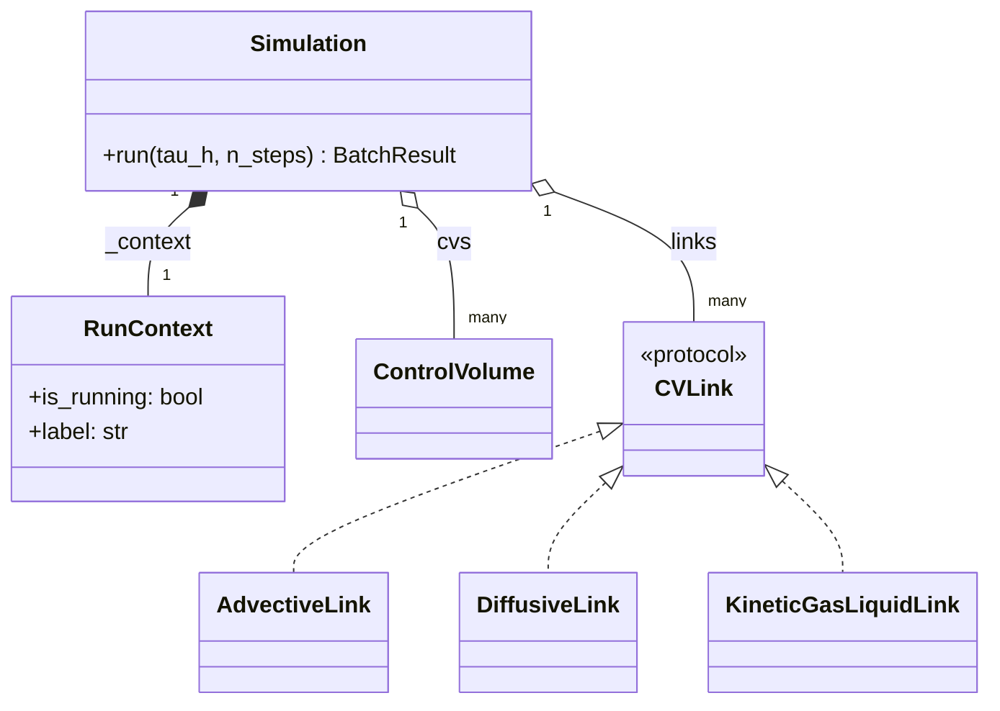
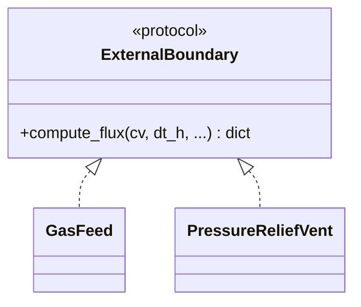
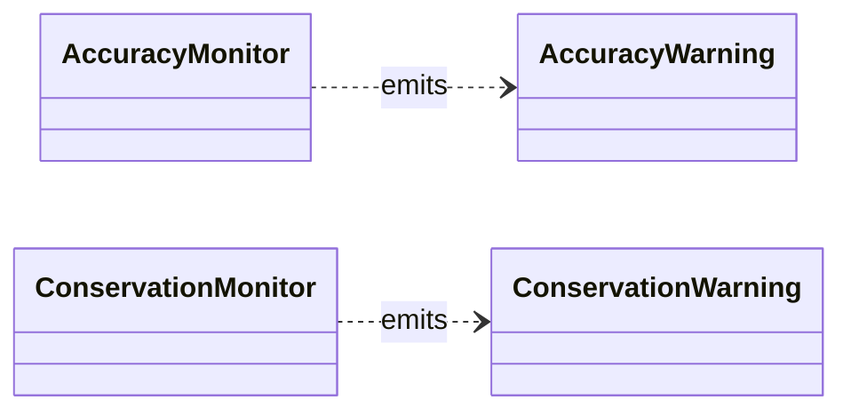
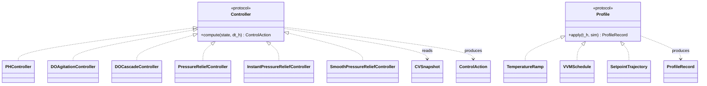

# Class Diagrams — Simplified

Compact, interface-only class diagrams of the PyOMES core. Mirrors the
structure of [architecture.md](architecture.md): one diagram per
section, each diagram showing **only the public surface and the
relationships** that connect classes. Attributes and methods are
omitted unless they're the single defining signal for that class
(typically the one method on a protocol, or one attribute that
disambiguates two siblings).

Use this file when you need the picture of how the pieces fit. For
the full annotated signatures see [class_diagrams.md](class_diagrams.md).

---

## 1 — ControlVolume at the centre

The CV owns all thermodynamic state and orchestrates a single
timestep via `advance(dt_h, t_h, ...)`. Phases hold mole inventories
and derived scalar properties; an optional `ReactionSystem` carries
the chemistry; an optional list of `PropertyCalculator`s feeds scalar
derived properties (viscosity, density, …); two monitors watch the
solve.

---

## 2 — Phases (storage)

State-unification put **everything** in one canonical `n_mol` dict:
totals, derived species (`CO2aq`, `H+`, `OH-`, …), strong ions
(`Na+`, `Cl-`, `S_cat`, `S_an`). The speciation engine writes derived
values back via `_refresh_derived(values)`. `phase.properties` is a
separate dict for scalar derived properties (viscosity, density, …)
written by `PropertyCalculator` instances.

---

## 3 — Reactions & chemistry

Three independent declaration classes (no shared base) carry the
chemistry. `ReactionSystem` is the **single attach point** on a CV;
it pre-buckets its contents by `isinstance` and lazily builds the
`BisectionChemicalEquilibriumEngine` from its equilibrium reactions. The engine writes
derived species directly to `phase.n_mol`. Scalar derived properties
(viscosity, density, …) live on a separate, narrower
`PropertyCalculator` protocol.

Note: `EquilibriumReaction` is deliberately **not** a `ReactionModel`
— it's algebraic, not rate-producing.

---

## 4 — Time-stepping

`cv.advance(...)` is the default sequential path. For stiffer or
larger-`dt_h` work, pass a `StepSolver` via `solver=` to replace the
body with a snapshot Euler or an adaptive `solve_ivp`-based pass.

---

## 5 — Multi-CV topology and orchestration

`Simulation` is the single orchestration class — it owns the
dict of CVs, the inter-CV link list, controllers, profiles, a
step solver (or per-CV dict), and a recorder. `Simulation.run`
drives the per-step loop. A shared `RunContext` flips
`is_running` on entry and exit so lockable mutators across the
system gate themselves consistently. (The legacy `MultiCVSystem`
was deleted in the `simulation-class` phase, 2026-05-27.)

`KineticGasLiquidLink` is dual-typed — it's both a `CVLink` (carries
material between CVs) and a `PhaseInterface` (acts as an internal
gas-liquid interface inside a single CV).

---

## 6 — External boundaries

State-dependent fluxes across the system edge — feed schedules,
vents, membranes, controller-driven dosing. Boundaries are a runtime
protocol; an `apply_boundary(boundary, cv, dt_h)` helper invokes
one and returns the diagnostic record.

---

## 7 — Monitoring

Two per-CV monitors auto-attached on the `ReactionSystem` surface.
`AccuracyMonitor` watches the speciation engine for solver-quality
signals; `ConservationMonitor` watches element + charge balance
across phases per `cv.advance` step. Both emit a `UserWarning`
subclass and share a throttle plumbing
(`once` / `first_N` / `always` / `silent`).

---

## 8 — Control system and profiles

Pattern 1 collapse (`simulation-class` 2026-05-27): each
`Controller` exposes a single `compute(state, dt_h) ->
ControlAction` method consuming a `CVSnapshot` (or
`SimulationSnapshot`). The legacy `Commands` dataclass and
`Actuator` protocol are deleted; internal state lives on the
controller. `Profile`s are open-loop time-varying mutators with
the same shape — `apply(t_h, sim) -> ProfileRecord`. The
`Simulation` orchestrator invokes both each step and routes
their outputs through Pattern B unchecked-setter dispatch.

`Simulation._step` calls `build_simulation_snapshot(...)` after
the CV advance to assemble a `SimulationSnapshot` (or hands the
single `CVSnapshot` directly for single-CV simulations); each
controller's `compute(state, dt_h)` returns a `ControlAction`,
which the orchestrator applies via `cv.apply_external_flux`
(`flux_applied`) and the `_resolve_param_path` semantic dispatch
to Pattern B unchecked setters (`params_changed`).

---

## Relationship key

- `<|--` solid arrow, hollow head — class inheritance.
- `<|..` dashed arrow, hollow head — protocol implementation.
- `*--` solid line, filled diamond — composition (lifecycle ownership).
- `o--` solid line, hollow diamond — aggregation (uses, doesn't own).
- `-->` solid arrow — association (holds reference).
- `..>` dashed arrow — dependency (uses transiently / produces).

---

## See also

- [architecture.md](architecture.md) — narrative description of the
  same picture, with the `advance()` sub-step ordering, directory
  structure, and orchestrator + control-system layers.
- [class_diagrams.md](class_diagrams.md) — full annotated diagrams
  with every public attribute and method.
- [solvers.md](solvers.md) — semantics of each `StepSolver`.
