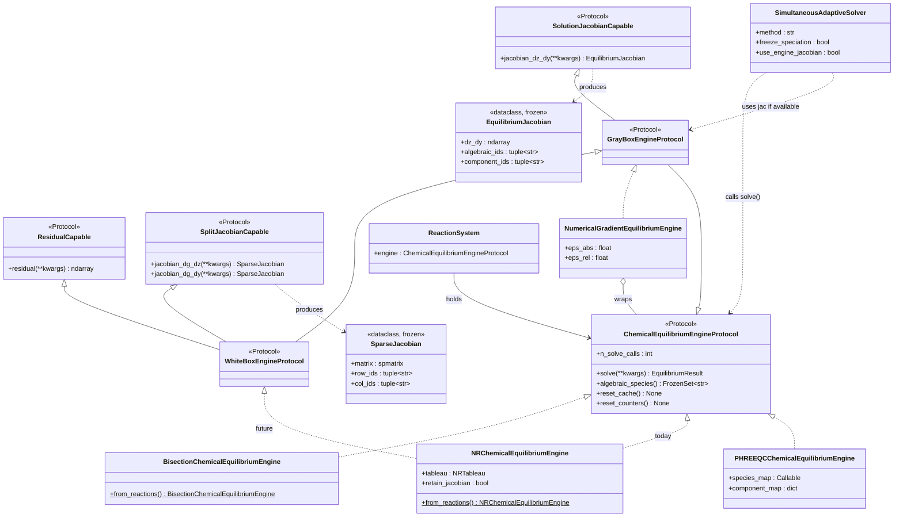

# Chemical Equilibrium Engine Architecture

> **Status:** Design record — initial design 2026-06-25, extended 2026-06-30.
>
> **Phases 1–5 shipped 2026-06-25:** `protocols.py` (protocols + data containers),
> `NumericalGradientEquilibriumEngine`, `PHREEQCChemicalEquilibriumEngine` (engine mode), `NRChemicalEquilibriumEngine`
> white-box path (`retain_jacobian`), `SimultaneousAdaptiveSolver` Jacobian integration
> (`use_engine_jacobian`). 1543 tests passing.
>
> **`EquilibriumResult` shipped 2026-07-01** (`EQUILIBRIUM_RESULT` phase, tag
> `equilibrium-result-shipped`; see
> [`docs/phases-shipped/EQUILIBRIUM_RESULT.md`](../phases-shipped/EQUILIBRIUM_RESULT.md)).
> This resolves the `solve() → EquilibriumResult` return-type question
> deferred from Phase 1 (§6, §8). `BisectionChemicalEquilibriumEngine`, `NRChemicalEquilibriumEngine`,
> and `PHREEQCChemicalEquilibriumEngine` all construct and return `EquilibriumResult`;
> `cv.advance()` / `ReactionSystem` call sites use attribute access and an
> explicit `apply_to_phases()` commit. 1543 → 1800 tests. Engine/Solver split
> (§2), `ChemicalEquilibriumSystem` (§3), and z-update strategies (§7) remain
> design content, not yet implemented.
>
> **Phase 6 (PHREEQC solver mode)** — agreed 2026-06-30; not yet scoped or
> implemented. Depends on `EquilibriumResult` (now shipped).
>
> **§18 rename shipped 2026-07-03** (CP6 of `LAYER1_GAP_CLOSURE`, tag
> `layer1-gap-closure-shipped`). The identifier mapping in §18 has been
> applied to the codebase: `SpeciationEngine`/`NRSpeciationEngine`/
> `PHREEQCEngine`/`NumericalGradientEngine`/`SpeciationEngineProtocol` all
> renamed to their `ChemicalEquilibriumEngine`-family target names, with
> the old names kept as backward-compatible plain-assignment aliases for
> one phase (e.g. `SpeciationEngine = ChemicalEquilibriumEngine`). The
> module itself also moved: `src/speciation/` → `src/chemical_equilibrium/`
> (§18's own deferred decision, executed at this same checkpoint — no
> backward-compatible import shim for the module path, only for the class
> identifiers within it). This document's own prior use of the target
> names throughout (including in the "shipped" status notes above,
> predating the codebase catching up) is why this section reads
> consistently before and after the rename.
>
> **`ChemicalEquilibriumEngine` renamed to `BisectionChemicalEquilibriumEngine`**
> (undated follow-up, same session). The unqualified name read as "the"
> default/canonical engine, when it is one of three peer implementations
> of `ChemicalEquilibriumEngineProtocol` (the others being
> `NRChemicalEquilibriumEngine` and `PHREEQCChemicalEquilibriumEngine`) —
> specifically the original, simplest one (1-D bisection over the charge
> balance). `ChemicalEquilibriumEngine` kept as a deprecated subclass alias
> for one phase. Unlike the CP6 rename above, this document's prior text
> did *not* anticipate this name — the "target names" throughout this doc
> now mean `BisectionChemicalEquilibriumEngine` specifically, not the
> intermediate `ChemicalEquilibriumEngine`.

---

## 1. Motivation

Three drivers shaped this design:

**1. External engines (PHREEQC).** A PHREEQC wrapper needs to satisfy the same
interface as `BisectionChemicalEquilibriumEngine` so that `ReactionSystem` and
`ControlVolume` can use it without modification. See §5.2 for the two modes in
which PHREEQC can integrate.

**2. Richer DAE coupling.** The existing operator-splitting approach calls the
engine as a black-box re-equilibration step. Implicit integration methods
(`SimultaneousAdaptiveSolver` with `method='BDF'` or `'Radau'`) can use Jacobian information
from the engine to build an analytical system Jacobian, avoiding
finite-difference approximation and improving step-size control on stiff
chemistry. See §4 and §7.

**3. Iterative solver consistency.** Calling `solve()` and writing results back
to `phases` as a side effect is incorrect inside adaptive or implicit ODE solvers:
the solver evaluates `compute_rhs()` multiple times per accepted step, each
triggering an equilibrium solve and overwriting phase state, including on
rejected trial steps. Separating solve from commit (§6) removes this
inconsistency.

See [`SOLVER_ARCHITECTURE.md`](SOLVER_ARCHITECTURE.md) for the
differential/algebraic variable split that underpins this design.

---

## 2. Engine / Solver split

The `BisectionChemicalEquilibriumEngine` owns two distinct concerns that must not be
conflated:

**The engine owns the problem formulation:**
- The equilibrium reaction set — what constraints `g(y, z) = 0` to enforce
- The `ThermoFramework` reference — thermodynamic conventions (activity model, EOS)
- The current algebraic state z — equilibrated concentrations, pH, ionic strength
- The reference interface — authoritative source of pH, I, partial pressures for
  callers such as `TransferModel`, `PropertyCalculator`, and `ReactionSystem`

**The solver owns the algorithm:**
- How to iterate toward `g(y, z) = 0` (Newton-Raphson, PHREEQC internal NR, scipy)
- Convergence criteria and step damping
- Warmstart / initial-guess management

This separation mirrors the pattern already used for kinetic integration:
`StepSolver` and `SystemSolver` own the ODE algorithm; the `ReactionSystem`
owns the kinetic rate model. The equilibrium side is now symmetric.

### 2.1 AlgebraicEquilibriumSolver

```python
class AlgebraicEquilibriumSolver(Protocol):
    """Numerical backend for solving g(y, z) = 0."""

    def solve_tableau(
        self,
        tableau,        # problem formulation (NR tableau, PHREEQC block, ...)
        z_init,         # starting point
        T_K: float,
    ) -> "EquilibriumResult":
        """Iterate to convergence; return immutable result. Does not write to phases."""
        ...
```

Concrete backends: `NREquilibriumSolver`, `PHREEQCAlgebraicSolver` (§5.2),
`SciPyAlgebraicSolver`. This protocol is internal to the engine family; callers
interact only with `ChemicalEquilibriumEngineProtocol`.

---

## 3. ChemicalEquilibriumSystem — problem specification

`ChemicalEquilibriumSystem` is a package-native, backend-agnostic specification
of a chemical equilibrium problem. It holds everything needed to define *what*
to solve, in VLsim's own terms, independently of *how* it will be solved:

```python
@dataclass(frozen=True)
class ChemicalEquilibriumSystem:
    reactions: Tuple[EquilibriumConstraint, ...]  # equilibria to enforce
    phases:    Dict[str, PhaseSpec]                # liquid / gas / solid topology
    thermo:    ThermoFramework                     # conventions
    species:   Dict[str, Species]                  # species declarations
```

> **Updated 2026-07-01** (design discussion, not yet implemented): `reactions`
> holds two constraint families, not one type. Acid-base, Henry, Ksp, and
> Raoult are mass-action rows — sibling types (`EquilibriumReaction`,
> `HenryEquilibrium`, `KspEquilibrium`, `RaoultEquilibrium`) sharing the
> structural `EquilibriumConstraint` Protocol (`stoichiometry`, `log_K(T_K)`,
> `dH_J_per_mol()`), each with `__init__` keywords matching its own domain's
> standard terminology (`H_ref`/`dlnH` for Henry, `Ksp` for solubility
> products) rather than collapsing into one generic representation; see
> `MASS_EXCHANGE_ARCHITECTURE.md` §14 for the derivation, naming rationale,
> and the PHREEQC/geochemical-tableau precedent. The `*Equilibrium` types
> additionally satisfy `PartitionModel` unchanged, so one constructed instance
> serves both the reaction-list role here and the kinetic-`TransferModel` role
> — see `EQUILIBRIUM_CONSTRAINT_UNIFICATION.md` for the concrete plan.
> Isotherms (Langmuir, Freundlich) are not mass-action-reformattable and
> remain a distinct constraint type built on `PartitionModel`/
> `MultispeciesPartitionModel`. `EquilibriumConstraint` is now the confirmed
> name (2026-07-01), not a placeholder.

Users define their system once. The choice of backend is a separate step — the
`ChemicalEquilibriumSystem` is compiled or translated for each:

```
ChemicalEquilibriumSystem
  │
  ├─→  NRTableau compilation          → NREquilibriumSolver
  ├─→  PHREEQCInputBlock translation  → PHREEQCAlgebraicSolver
  └─→  scipy problem assembly         → SciPyAlgebraicSolver
```

This provides a single canonical problem definition. Backend-specific validation
(incompatible EOS choices, reactions PHREEQC cannot represent, etc.) surfaces at
translation time, not buried in the solver at runtime.

`ReactionSystem` already partially plays this role (it holds reactions and routes
them to an engine). `ChemicalEquilibriumSystem` is the pure equilibrium subset —
only the `g(y, z) = 0` system, with no kinetic reactions mixed in.

---

## 4. Protocol hierarchy — black / gray / white box

In the DAE formulation the equilibrium problem partitions state as:

```
dy/dt = f(y, z)     ← kinetics     (differential, ODE sub-step)
0     = g(y, z)     ← equilibrium  (algebraic, chemical equilibrium engine)
```

Three engine tiers differ in how much of `g` they expose to callers:

| Tier | Exposes | DAE solver use |
|---|---|---|
| **Black box** | `z = h(y)` — solution mapping only | Operator splitting; algebraic elimination in explicit ODE |
| **Gray box** | `∂z/∂y` — total sensitivity of solution | Analytical Jacobian for implicit ODE (`solve_ivp jac=`) |
| **White box** | `g(y,z)`, `∂g/∂z`, `∂g/∂y` — full residual + split Jacobians | Full coupled DAE Jacobian; Schur complement; LU reuse |

The split Jacobians are strictly more informative than the total sensitivity:
`∂z/∂y = −(∂g/∂z)⁻¹ ∂g/∂y` by the implicit function theorem, but the factors
are available separately in a white-box engine and can be exploited directly
without the matrix inversion.

A **numerical gradient wrapper** (`NumericalGradientEquilibriumEngine`, §11)
sits between black and gray: it wraps any black-box engine and approximates
`∂z/∂y` by finite-differencing `solve()` over perturbed component totals.

### 4.1 Mixin protocol diagram

Capability is expressed through orthogonal mixin protocols that compose into the
named tiers. This avoids a rigid single-inheritance chain: a future engine could
expose residuals but not split Jacobians, and a solver can declare exactly the
minimum capability it needs.



---

## 5. AlgebraicEquilibriumSolver backends

### 5.1 NR backend

`NREquilibriumSolver` runs Newton-Raphson on the log-activity tableau. It is
purely the numerical algorithm; the tableau (the problem formulation) is held by
the engine and compiled from the `ChemicalEquilibriumSystem` at construction time.

The tier exposed by the engine is configured at construction:

- `retain_jacobian=False` (default): converged NR matrix is discarded → black-box tier
- `retain_jacobian=True`: converged matrix is cached → white-box tier unlocked

When `retain_jacobian=False`, calling white-box methods raises:

```
RuntimeError: Jacobian retention is disabled.
Construct NRChemicalEquilibriumEngine with retain_jacobian=True.
```

### 5.2 PHREEQC — Engine mode vs Solver mode

PHREEQC can integrate into the architecture in two distinct ways. The distinction
is whether VLsim's `ThermoFramework` is honoured or PHREEQC's own thermodynamic
database takes precedence.

**Engine mode (`PHREEQCChemicalEquilibriumEngine` — black box).**
PHREEQC is treated as a complete, self-contained equilibrium calculator. VLsim
passes component totals (with name translation via `component_map`), PHREEQC
equilibrates using its own database, and species concentrations are read back via
`species_map`. `ThermoFramework` is used only for standard-state temperatures and
naming conventions; Keq values and the activity model come from PHREEQC's own
database. Satisfies `ChemicalEquilibriumEngineProtocol` as a black-box engine.
The right choice when full PHREEQC thermodynamic rigour is desired and the user
accepts that VLsim's declared reaction parameters are overridden.

**Solver mode (`PHREEQCAlgebraicSolver` — backend for VLsim's problem).**
VLsim's `ChemicalEquilibriumSystem` defines the problem (reactions, Keq,
activity model from `ThermoFramework`). A translation layer converts this into
PHREEQC's input format (SOLUTION_MASTER_SPECIES, SOLUTION_SPECIES blocks, logK
values from declared `EquilibriumReaction` objects). PHREEQC then acts as the
numerical backend — its internal NR solver is used, but thermodynamic values come
from VLsim's declarations. Results are parsed back as an `EquilibriumResult`.
Incompatible features (advanced gas EOS, NRTL activity, competitive adsorption)
raise warnings or errors at solver construction, not at runtime.

**Sub-option: PHREEQC database as Keq source.**
A variant of solver mode in which VLsim controls which reactions to include but
pulls reference Keq and dH values from PHREEQC's database. Useful for validation
and for bootstrapping new reaction sets from a well-tested thermodynamic reference.

| | Engine mode | Solver mode |
|---|---|---|
| `ThermoFramework` honoured | Name translation only | Fully (within PHREEQC's representational limits) |
| Keq source | PHREEQC database | Declared `EquilibriumReaction` (or PHREEQC db as sub-option) |
| Activity model | PHREEQC's own | VLsim's `LiquidPhaseModel` (Davies, SIT) |
| Incompatible features | N/A | Warning/error at solver construction |
| Use when | Full PHREEQC rigour desired | VLsim primary; PHREEQC as numerical backend |

Implementation of solver mode and the Keq sub-option are to be scoped as a
separate phase after engine mode is shipped.

### 5.3 SciPy backend

`SciPyAlgebraicSolver` uses `scipy.optimize.root` to solve `g(y, z) = 0`.
Lower performance than the NR backend for large systems; useful for simpler
systems, prototyping, and testing engine protocol compliance without the full NR
infrastructure.

---

## 6. EquilibriumResult — immutable solve output

`solve()` returns an immutable `EquilibriumResult` and makes no side-effecting
writes to phases. Phase state is updated only by an explicit `apply_to_phases()`
call — the commit point.

```python
@dataclass(frozen=True)
class EquilibriumResult:
    """Immutable snapshot of a converged equilibrium solve."""
    pH:                    float
    ionic_strength:        float
    species_mol_L:         Dict[str, float]   # all equilibrated species
    partial_pressures_atm: Dict[str, float]   # gas-phase fugacities
    saturation_indices:    Dict[str, float]   # mineral saturation indices

    def apply_to_phases(self, phases: Dict[str, Phase]) -> None:
        """Commit this result to phase state. Called explicitly by cv.advance()
        when a step is accepted, not on every RHS evaluation."""
        ...
```

The engine holds a reference to its most recent converged result:

```python
engine.current_result     → EquilibriumResult   # last converged solve
engine.pH                 → float               # convenience accessor
engine.ionic_strength     → float
engine.partial_pressure(species) → float
```

**Engine as authoritative reference.** `TransferModel`, `PropertyCalculator`,
and `ReactionSystem.compute_reaction_rates()` should read from
`engine.current_result`, not from `phase.speciation` directly during active
integration. `phase.speciation` is a committed snapshot populated by
`apply_to_phases()`.

**Standalone use.** Constructing an engine and calling `solve()` without a CV
produces an `EquilibriumResult` that can be inspected directly — no phases, no
CV, no commit step required. This is the correct path for debugging, benchmarking
backends, and standalone equilibrium calculation utilities.

**Protocol note.** The original 2026-06-25 design recorded `solve() → Dict[str, Any]`
to accommodate external implementors. Changing to `solve() → EquilibriumResult`
is a breaking change to the protocol. Resolution required before Phase 1
(see §8).

---

## 7. Coupling to system solvers — z-update strategies

The engine's `solve()` is called at different frequencies depending on the system
solver. The four strategies span the accuracy/cost trade-off:

| Strategy | z-update rule | Engine calls per accepted step | Jacobian accuracy |
|---|---|---|---|
| **SNIA / operator splitting** (current default) | Freeze z at y_n; advance kinetics with fixed z | 1 | Approximate — O(Δt) splitting error |
| **BDF + frozen z** | Freeze z at y_n for all corrector evaluations | 1 | Approximate — missing `(∂f/∂z)(∂z/∂y)` coupling term |
| **BDF + white-box Jacobian** | Linear predictor: `z* ≈ z_n + (∂z/∂y)(y* − y_n)` | 1 solve + 1 Jacobian at step start | Full — coupling term present analytically |
| **BDF + fully coupled** | Re-solve equilibrium at every corrector trial y* | ~6–10 per step | Full — exact at each trial point |

**BDF + white-box Jacobian is the target for implicit solvers.** It achieves
formal accuracy at near-SNIA cost: one equilibrium solve per accepted step, with
the coupling terms `(∂f/∂z)(∂z/∂y)` supplied analytically via
`GrayBoxEngineProtocol.jacobian_dz_dy()`. This is already anticipated by the
`use_engine_jacobian` flag on `SimultaneousAdaptiveSolver`.

**Frozen-z accuracy cost.** Under BDF with frozen z, the corrector solves:
`G̃(y*) = y* − y_n − h·f(y*, z_n) = 0` rather than the true
`G(y*) = y* − y_n − h·f(y*, z(y*)) = 0`. The error is O(Δt) × ‖∂z/∂y‖ × ‖Δy‖.
For pH-sensitive systems (where `∂pH/∂[HCO₃⁻]_total` is large), this is not
always negligible at large timesteps.

**Active-set discontinuities.** When precipitation equilibria switch in or out,
`∂z/∂y` is discontinuous at that boundary. The linear predictor becomes
structurally wrong across an active-set transition. This is a design gate for the
implicit solver path when mineral equilibria are active — it must be addressed
before the white-box Jacobian strategy is used with `_precipitation_equilibria`.

**The `solve() → EquilibriumResult` separation supports all four strategies
transparently.** The system solver controls how many times it calls `solve()` and
when it calls `apply_to_phases()`. The engine does not need to know which strategy
is in use.

---

## 8. Design decisions

Decisions from the 2026-06-25 session are marked **(6-25)**; from 2026-06-30
are marked **(6-30)**.

**`from_reactions` is not part of the Protocol. (6-25)**
Construction paths differ too much between engines to impose a common factory
signature. `NRChemicalEquilibriumEngine` builds a log-activity tableau;
`BisectionChemicalEquilibriumEngine` builds a pKa ladder; `PHREEQCChemicalEquilibriumEngine`
translates reactions into a PHREEQC INPUT block. Each engine exposes its own
`from_reactions` classmethod by convention. Dispatch lives in `ReactionSystem`
via its existing `solver=` kwarg.

**`@runtime_checkable` on all protocols. (6-25)**
Enables `isinstance(engine, GrayBoxEngineProtocol)` at runtime without importing
concrete types. Required by `SimultaneousAdaptiveSolver` capability detection.

**`solve()` returns `EquilibriumResult` — resolved 2026-06-30, shipped 2026-07-01. (6-25 vs 6-30)**
Clean break: `solve(**kwargs) → EquilibriumResult`. No `Mapping` shim. The
codebase is pre-release; the clean API is worth a bounded migration. Migration
scope: `NRChemicalEquilibriumEngine`, `BisectionChemicalEquilibriumEngine`, `PHREEQCChemicalEquilibriumEngine` construct and
return `EquilibriumResult`; `cv.advance()` and `ReactionSystem` switch to
attribute access (`result.pH` not `result["pH"]`); test files updated
mechanically. Shipped as the `EQUILIBRIUM_RESULT` phase (tag
`equilibrium-result-shipped`) after THERMODYNAMIC_MODEL_ARCHITECTURE. The
migration also touched `numerical_gradient.py` and `speciation/api.py` —
call sites not anticipated by the original scope note above, found while
tracing the full call graph before implementation. `solve()` makes no
side-effecting writes to phases; the 7 production call sites that relied on
that side effect were cut over atomically (single checkpoint) to an explicit
`result.apply_to_phases(phases)` commit, to avoid a window where some paths
silently stopped receiving derived-species writeback.

**`NumericalGradientEquilibriumEngine` uses combined epsilon. (6-25)**
`eps_j = max(eps_abs, eps_rel × |T_j|)`. Defaults: `eps_abs=1e-10`, `eps_rel=1e-5`.

**`NRChemicalEquilibriumEngine` Jacobian retention is opt-in. (6-25)**
`retain_jacobian=False` default. White-box methods raise `RuntimeError` when false.

**`SimultaneousAdaptiveSolver` Jacobian use is opt-in with a warning. (6-25)**
`use_engine_jacobian=False` default. Warning raised once per `solve_step()` when
the engine satisfies `GrayBoxEngineProtocol` but the flag is false.

**Engine is the authoritative reference for algebraic z-state. (6-30)**
`phase.speciation` is a commit point (populated by `apply_to_phases()`), not the
live truth during integration. Callers that read `phase.speciation["pH"]` during
RHS evaluation should be migrated to `engine.current_result.pH`.

> **Known gap, found 2026-07-01**: this migration is incomplete.
> `ControlVolume`'s property-calculator support
> (`src/core/control_volume.py`, ionic-strength lookup) still reads
> `phase.speciation.get("IonicStrength")` directly rather than
> `engine.current_result.ionic_strength`. Harmless under the current
> explicit-Euler `cv.advance()` (property calculators run only after
> `apply_to_phases()` has committed), but latent for the deferred DAE/BDF path
> (§7 of `MASS_EXCHANGE_ARCHITECTURE.md`): if `compute_rhs()` is ever
> evaluated on a rejected trial step without a commit, this read would return
> the previous accepted step's value, not the trial's. Worth completing this
> migration before or alongside the white-box BDF work, not urgent now.

**PHREEQC dual-mode: Engine mode and Solver mode are both valid. (6-30)**
Engine mode: PHREEQC owns thermodynamics; VLsim does name translation only.
Solver mode: VLsim owns thermodynamics; PHREEQC is the numerical backend.
Solver mode and the Keq sub-option are deferred to a later phase.

---

## 9. Data containers

### EquilibriumJacobian

Returned by `SolutionJacobianCapable.jacobian_dz_dy()`. A frozen dataclass
carrying the dense total-sensitivity matrix with row and column labels for
alignment with the solver's state vector:

```
dz_dy[i, j]  =  ∂c_i / ∂T_j
```

where `c_i` is the equilibrated concentration of algebraic species `i` (indexed
by `algebraic_ids`) and `T_j` is the total concentration of component `j`
(indexed by `component_ids`).

### SparseJacobian

Returned by `SplitJacobianCapable.jacobian_dg_dz()` and `jacobian_dg_dy()`.
Wraps a `scipy.sparse` matrix with named row and column indices. CSR format for
efficient row-slicing during block elimination.

---

## 10. Capability contracts

### `ChemicalEquilibriumEngineProtocol` (black box)

`solve(**kwargs) -> EquilibriumResult`
: Reads component totals from `phases["liquid"].n_mol`, solves the equilibrium
  system, returns an immutable `EquilibriumResult`. Does **not** write to phases.
  Primary call pattern in `ControlVolume.advance()`:

  ```python
  result = engine.solve(phases=self.phases, T_K=float(liq.T_K))
  # ... (step accepted) ...
  result.apply_to_phases(self.phases)
  ```

`algebraic_species() -> FrozenSet[str]`
: Returns the set of species IDs owned by this engine (the algebraic z-state).
  Differential state (y) is the complement. DAE solvers use this at setup time
  to partition state. Engines that require a solve before the species set is known
  (e.g. `PHREEQCChemicalEquilibriumEngine`) must perform a priming solve at
  construction time and may return a conservative superset.

`reset_cache() -> None`
: Clears warmstart state. Called by `Simulation` at the start of a run.

`reset_counters() -> None`
: Resets `n_solve_calls` to zero.

### `SolutionJacobianCapable` (gray box addition)

`jacobian_dz_dy(**kwargs) -> EquilibriumJacobian`
: Returns total sensitivity `∂z/∂y` at the current operating point. May reuse
  the most recently converged state when called immediately after `solve()`.

### `SplitJacobianCapable` (white box addition)

`jacobian_dg_dz(**kwargs) -> SparseJacobian`
: `∂g/∂z` — Jacobian of residuals with respect to algebraic variables. For NR
  engines: the converged NR matrix, available when `retain_jacobian=True`.

`jacobian_dg_dy(**kwargs) -> SparseJacobian`
: `∂g/∂y` — Jacobian of residuals with respect to component totals. For
  mass-balance formulations: a sparse stoichiometric selection matrix derivable
  from the tableau at construction time.

### `ResidualCapable` (white box addition)

`residual(**kwargs) -> ndarray`
: Evaluates `g(y, z)` at an arbitrary `(y, z)` without updating internal state.
  One entry per equilibrium constraint. Used by implicit DAE solvers to check
  constraint satisfaction without calling `solve()`.

---

## 11. NumericalGradientEquilibriumEngine

Wraps any `ChemicalEquilibriumEngineProtocol` and satisfies `GrayBoxEngineProtocol`
by computing `jacobian_dz_dy()` via central finite differences:

```
eps_j  =  max(eps_abs, eps_rel × |T_j|)

∂c_i/∂T_j  ≈  [h(T + eps_j·eⱼ) − h(T − eps_j·eⱼ)] / (2·eps_j)
```

`eps_abs` (default `1e-10` mol/L) dominates as totals approach zero.
`eps_rel` (default `1e-5`) dominates in the millimolar range typical of
bioprocess chemistry. Setting either to zero gives pure absolute or pure relative
mode.

Requires `n_components` pairs of `solve()` calls per Jacobian evaluation.

Cannot satisfy `ResidualCapable` or `SplitJacobianCapable` — it has no access
to `g` itself, only to `h`.

---

## 12. PHREEQCChemicalEquilibriumEngine — engine mode

This section covers the engine mode integration (§5.2). Solver mode
implementation is deferred to a later phase.

### Package

`phreeqpython` (v1.6.2 confirmed installed) preferred over the lower-level
`phreeqpy`. Provides a Pythonic `Solution` object with direct access to
`sol.species` (mol/L dict), `sol.pH`, `sol.I`, and `sol.masters_species`.

Declared as an optional dependency:

```toml
[project.optional-dependencies]
phreeqc = ["phreeqpython>=1.6"]
```

A clear `ImportError` with install instructions is raised at instantiation if
the package is absent.

### Constructor parameters

```python
PHREEQCChemicalEquilibriumEngine(
    components: dict[str, float],       # {vlsim_component_id: initial_mmol_L}
    *,
    component_map: dict[str, str],      # vlsim component ID → PHREEQC element key
    species_map: Callable[[str], str] = phreeqc_to_vlsim,
    T_C: float = 25.0,
    use_warmstart: bool = True,
)
```

### Translation layers

**`component_map`** translates VLsim component IDs to PHREEQC element keys:

| VLsim component | PHREEQC key |
|---|---|
| `"CO2"` | `"C"` |
| `"NH3"` | `"N"` |
| `"H2S"` | `"S(-2)"` |
| `"SO4"` | `"S(6)"` |
| `"Ca"` | `"Ca"` |

For elements with a single dominant oxidation state at expected pH (`Ca`, `Na`,
`Cl`), the bare element name is sufficient. For multi-valent elements (`C`, `N`,
`S`, `Fe`), PHREEQC oxidation-state notation is required.

**`species_map`** is a callable `(phreeqc_name: str) -> vlsim_name: str` applied
to every key in `sol.species` before writing to results. The default
`phreeqc_to_vlsim` applies:

1. Exceptions dict (`"Fe+2" → "Fe2+"`, `"Fe+3" → "Fe3+"`)
2. Structural regex: `Ca+2 → Ca++`, `SO4-2 → SO4--`
3. Pass-through for singly-charged species (identical naming in both systems)

`species_map=None` disables translation — correct when VLsim species IDs use
PHREEQC naming conventions from the start.

### Unit conventions

`phreeqpython.add_solution` input: **mmol/L**.
`sol.species` output: **mol/L**, matching VLsim's `phase.n_mol`.

### `algebraic_species()` — priming solve

The species set is only known after a solve. `__init__` performs a priming solve
using the `components` dict, caching `sol.masters_species` in
`_algebraic_species_cache`. Returns a conservative superset.

### Repeated solve mechanism

`sol.change(composition, units='mmol')` mutates the `Solution` in-place.
`use_warmstart=True`: previous equilibrium state serves as the initial guess.
`use_warmstart=False`: a fresh solution is created on each call.

---

## 13. Integration with existing infrastructure

### `ReactionSystem`

`engine` is typed as `ChemicalEquilibriumEngineProtocol`. No change required.
`isinstance(engine, GrayBoxEngineProtocol)` checks (enabled by
`@runtime_checkable`) let callers detect richer engines without importing
concrete types.

### `SimultaneousAdaptiveSolver`

`use_engine_jacobian=False` (default). When the engine satisfies
`GrayBoxEngineProtocol` but the flag is false, a `UserWarning` is raised once
per `solve_step()` call:

```
UserWarning: engine satisfies GrayBoxEngineProtocol but use_engine_jacobian=False.
Pass use_engine_jacobian=True to SimultaneousAdaptiveSolver to enable analytical Jacobian.
```

When true, `jacobian_dz_dy()` output is passed to `solve_ivp(jac=...)`.

### `NRChemicalEquilibriumEngine` — future white-box path

The NR Jacobian matrix (`∂g/∂z`) is computed at every solve and currently
discarded after convergence. Setting `retain_jacobian=True` at construction
caches it, unlocking `jacobian_dg_dz()`, `jacobian_dg_dy()`, and `residual()`.
Deferred to Phase 4.

---

## 14. DAE solver dependencies

| Solver approach | Required dependency |
|---|---|
| Operator splitting (current) | None |
| Implicit ODE with analytical Jacobian | `scipy` (already present) |
| Custom BDF-1/2 for index-1 DAE | `scipy.sparse` (already present) |
| Variable-order implicit DAE (SUNDIALS IDA) | `assimulo` or `scikits.odes` (optional, future) |

SUNDIALS remains the natural upgrade path for very stiff tightly-coupled
chemistry, but the protocol hierarchy is forward-compatible without requiring it.

---

## 15. Backward compatibility

The existing `BisectionChemicalEquilibriumEngine` and `NRChemicalEquilibriumEngine` already satisfy
`ChemicalEquilibriumEngineProtocol` structurally (duck-typed), modulo the
`solve()` return type resolution in §8. No changes to either class are required
in Phase 1. All existing callers continue to work.

`@runtime_checkable` on all protocols enables `isinstance` checks without
coupling callers to concrete types.

---

## 16. File layout

```
src/speciation/                        ← module rename deferred; see §18
    protocols.py                       ← ChemicalEquilibriumEngineProtocol,
                                         capability mixins, EquilibriumJacobian,
                                         SparseJacobian, EquilibriumResult
    numerical_gradient.py              ← NumericalGradientEquilibriumEngine
    phreeqc_engine.py                  ← PHREEQCChemicalEquilibriumEngine
                                         (Phase 3; requires phreeqpython)
    engine.py                          ← BisectionChemicalEquilibriumEngine (unchanged)
    nr_engine.py                       ← NRChemicalEquilibriumEngine (unchanged;
                                         white-box path is Phase 4)
```

---

## 17. Implementation phases

| Phase | Scope | Status |
|---|---|---|
| 1 | `protocols.py` — `ChemicalEquilibriumEngineProtocol`, capability mixins, `EquilibriumJacobian`, `SparseJacobian` | Shipped 2026-06-25 |
| 1b | `EquilibriumResult` + `apply_to_phases()`; resolve `solve()` return type — carved out of Phase 1's original scope, shipped separately | Shipped 2026-07-01 (`EQUILIBRIUM_RESULT`, tag `equilibrium-result-shipped`) |
| 2 | `numerical_gradient.py` — `NumericalGradientEquilibriumEngine` | Shipped 2026-06-25 (structure); `EquilibriumResult` consumption shipped 2026-07-01 |
| 3 | `phreeqc_engine.py` — `PHREEQCChemicalEquilibriumEngine` (engine mode) | Shipped 2026-06-25 (structure); `EquilibriumResult` return shipped 2026-07-01 |
| 4 | `NRChemicalEquilibriumEngine` white-box path — `retain_jacobian` flag, `SplitJacobianCapable`, `ResidualCapable` | Shipped 2026-06-25 |
| 5 | `SimultaneousAdaptiveSolver` Jacobian integration — `use_engine_jacobian` flag and warning | Shipped 2026-06-25 |
| 6 | PHREEQC solver mode — `PHREEQCAlgebraicSolver`; translation layer; incompatibility validation | Not started |

---

## 18. Rename — shipped 2026-07-03

**Decision recorded 2026-06-30. Executed 2026-07-03** (CP6/CP7 of
`LAYER1_GAP_CLOSURE`, tag `layer1-gap-closure-shipped`). Old names remain
as backward-compatible aliases for one phase (plain assignment, e.g.
`SpeciationEngine = ChemicalEquilibriumEngine` — no `DeprecationWarning`),
matching the `DaviesActivityModel = DaviesLiquidModel` pattern in
`src/chemical_equilibrium/activity_models.py` (module renamed alongside
the classes — see the module-rename row below).

The `SpeciationEngine` family was renamed to `ChemicalEquilibriumEngine`
(itself later renamed to `BisectionChemicalEquilibriumEngine` — see the
status note at the top of this document).

**Rationale.** "Speciation" is a geochemistry term of art meaning the
distribution of a dissolved element across its aqueous forms. As the engine
grows to handle gas-liquid and solid-liquid equilibria (Layer 1 gap closure), the
name misleads users outside a geochemistry background. `ChemicalEquilibriumEngine`
is accurate at both the current and target scope, and correctly positions the
object as the owner of all instantaneous chemical equilibrium — the `g(y, z) = 0`
system in the DAE formulation.

**Timing.** The rename accompanies the Layer 1 gap closure phase. It is not a
standalone refactor — an API break with no functional change is not worth the
disruption.

**Aliases removed 2026-07-03.** The "one phase" backward-compat window closed
the same day it opened — no code outside the alias-definition lines themselves
referenced the old names by the time the rename shipped, so the five aliases
(`SpeciationEngine`, `NRSpeciationEngine`, `PHREEQCEngine`,
`NumericalGradientEngine`, `SpeciationEngineProtocol`) were deleted outright
rather than carried forward. Only the new names are live now.

**Identifier mapping** (historical record — "Current"/"Proposed" as of the
2026-06-30 decision; both columns were live only briefly, see removal note
above).

| Current name | Proposed name |
|---|---|
| `SpeciationEngine` | `ChemicalEquilibriumEngine` |
| `NRSpeciationEngine` | `NRChemicalEquilibriumEngine` |
| `PHREEQCEngine` | `PHREEQCChemicalEquilibriumEngine` |
| `NumericalGradientEngine` | `NumericalGradientEquilibriumEngine` |
| `SpeciationEngineProtocol` | `ChemicalEquilibriumEngineProtocol` |
| `GrayBoxEngineProtocol` | unchanged — already generic |
| `WhiteBoxEngineProtocol` | unchanged — already generic |
| `algebraic_species()` | unchanged — "algebraic" correctly references the DAE split |
| `src/speciation/` module | renamed to `src/chemical_equilibrium/` — decided and executed at CP7 (no import-path backward-compat shim, unlike the class aliases above) |

---

## Cross-references

- [`SOLVER_ARCHITECTURE.md`](SOLVER_ARCHITECTURE.md) —
  differential/algebraic variable split; Layer 1/2/3 solver coupling;
  `SimultaneousAdaptiveSolver` method options; reactive D_eff extension
- [`THERMODYNAMIC_MODEL_ARCHITECTURE.md`](THERMODYNAMIC_MODEL_ARCHITECTURE.md) —
  `LiquidPhaseModel`; `ThermoFramework` as holder of `gas_eos` and
  `liquid_activity`; open questions §8.3 (`EquilibriumScope` vs
  `algebraic_species()`) and §8.4 (Jacobian contribution from `LiquidPhaseModel`)
- [`MASS_EXCHANGE_ARCHITECTURE.md`](MASS_EXCHANGE_ARCHITECTURE.md) —
  `PartitionModel` bridge; SNIA step sequence; Layer 1 gap; open question §12 Q8
  (`EquilibriumScope` vs `algebraic_species()`); §12 Q9 (surface complexation /
  reactive adsorption — deferred note for future backend/tableau planning);
  §14 (constraint-family taxonomy, wrapping litmus test, precipitation
  resolution and its `NRTableau` master-selection limit)
- [`SPECIATION_REACTIONMODEL_BOUNDARY.md`](SPECIATION_REACTIONMODEL_BOUNDARY.md) —
  why kinetics and equilibrium are separated at runtime; stiffness rationale
- [`src/speciation/nr_engine.py`](../../src/speciation/nr_engine.py) —
  `NRChemicalEquilibriumEngine` current implementation
- [`src/speciation/engine.py`](../../src/speciation/engine.py) —
  `BisectionChemicalEquilibriumEngine` current implementation
- [`src/thermo/framework.py`](../../src/thermo/framework.py) —
  `ThermoFramework` current implementation
