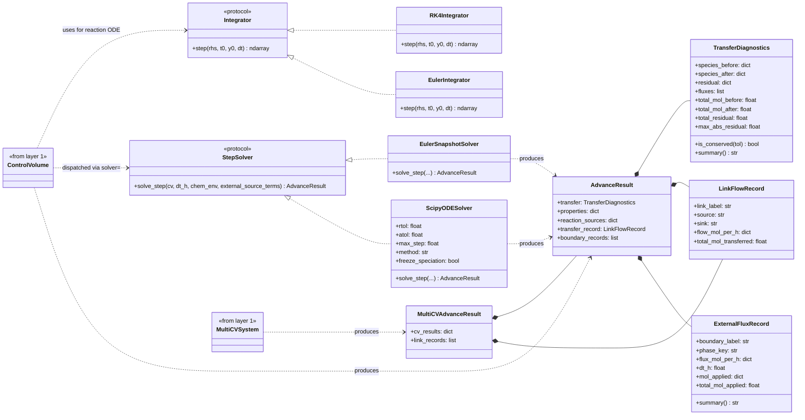
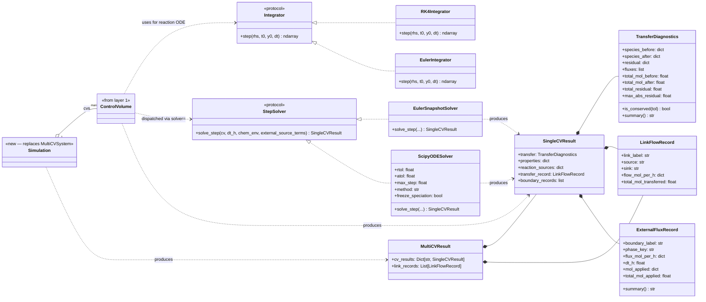

# Class Diagram Comparison — Result-Type Rename

**Status:** Exploration artifact (2026-05-18). Not a decided change.
Captures the diagram effect of renaming `AdvanceResult` →
`SingleCVResult` and `MultiCVAdvanceResult` → `MultiCVResult`, with
the containment relationship (MultiCV *contains* SingleCV) made
explicit.

> **Filed 2026-05-20** under `docs/upcoming/` (was at repo
> root; moved during integrator-removal cleanup). The L401-L414
> "current text" quote of `class_diagrams.md` §2 intro was
> refreshed to reflect the post-`integrator-removal` rewrite —
> the old version referenced `Integrator strategies` which no
> longer exist. The substantive rename question + the
> MultiCVResult-survival design question are unaffected.

Scope of this comparison: Section 2 ("Integration / time-stepping")
of [../class_diagrams.md](../class_diagrams.md). The rename
also touches Section 1 (`ControlVolume.advance` return type
annotation, the orchestrator class's `advance` return type
annotation) but the substantive structural change all lives in
Section 2.

The suggested diagram folds in **two** changes:

1. **Result-type rename.** `AdvanceResult` → `SingleCVResult`,
   `MultiCVAdvanceResult` → `MultiCVResult`.
2. **Orchestrator replacement.** Per decision 1 in the
   [SIMULATION_CLASS phase](SIMULATION_CLASS.md),
   `MultiCVSystem` is replaced by a new `Simulation` class.
   `Simulation` owns the per-CV topology (`cvs`) and produces the
   system-level step result.

One thing held constant: the locked SIMULATION_CLASS design also
plans to **delete `MultiCVResult`** itself, pushing per-step
aggregation onto a pluggable `Recorder`. This diagram does not
reflect that further change — it presents a world where
`Simulation` exists *and* `MultiCVResult` still serves as
`Simulation`'s per-step return type. See *Design observation* below
for why that combination is worth flagging.

---

## Current

Reproduced verbatim from
[../class_diagrams.md §2](../class_diagrams.md#L177-L274).



---

## Suggested



---

## What changed

### Class renames and replacement

| Before                 | After             | Kind of change                          |
|------------------------|-------------------|-----------------------------------------|
| `AdvanceResult`        | `SingleCVResult`  | Rename (same fields, same role)         |
| `MultiCVAdvanceResult` | `MultiCVResult`   | Rename (same fields, same role)         |
| `MultiCVSystem`        | `Simulation`      | Replacement (new class per SIMULATION_CLASS) |

Both result types now name their scope explicitly and sit at the
same naming level. Today's asymmetry (`AdvanceResult` unqualified,
`MultiCVAdvanceResult` qualified) is removed.

`Simulation` is not a rename of `MultiCVSystem` — it is a new class
that subsumes the old one's responsibilities and goes further
(controllers, profiles, lifecycle gating, recorder). For Section 2
purposes (integration / time-stepping), the relevant change is that
`Simulation` takes over `MultiCVSystem`'s producer role for the
system-level result type. The `<<from layer 1>>` annotation on the
old `MultiCVSystem` box becomes `<<new — replaces MultiCVSystem>>`
on the new `Simulation` box; the full Simulation shape is owned by
Section 1.

### Return-type annotations on producers

Every method that returned `AdvanceResult` now returns
`SingleCVResult`:

- `StepSolver.solve_step(...) -> SingleCVResult`
- `EulerSnapshotSolver.solve_step(...) -> SingleCVResult`
- `ScipyODESolver.solve_step(...) -> SingleCVResult`
- `ControlVolume ..> SingleCVResult : produces`

`Simulation` (replacing `MultiCVSystem`) returns `MultiCVResult`
from its per-step entry point (e.g. `Simulation._step` or
`Simulation.run`'s internal step primitive).

### Composition arrow added at Section 2

The current diagram shows `ControlVolume` and `MultiCVSystem` as
two `<<from layer 1>>` stubs with no relationship drawn between
them in Section 2 (their containment relationship is shown in
Section 1: `MultiCVSystem "1" o-- "many" ControlVolume : cvs`).

The suggested diagram adds the same composition arrow at Section
2, now between the renamed classes:

```
Simulation "1" o-- "many" ControlVolume : cvs
```

Mild Section 1 / Section 2 duplication, but makes the integration
view self-contained: a reader can see at a glance that
`Simulation` owns CVs and produces a `MultiCVResult` containing
their per-CV `SingleCVResult`s.

### Field-type annotations on `MultiCVResult`

The current diagram shows untyped dict / list:
```
+cv_results: dict
+link_records: list
```
The suggested diagram tightens these to:
```
+cv_results: Dict[str, SingleCVResult]
+link_records: List[LinkFlowRecord]
```
This is documentation-only — the underlying types haven't changed,
the diagram just makes them visible. Worth doing alongside the
rename so the containment story is readable from the box.

### Composition arrow that tells the story

Both diagrams contain `MultiCVResult *-- SingleCVResult` (today
spelled `MultiCVAdvanceResult *-- AdvanceResult`). The arrow's
*meaning* doesn't change. What changes is that the renamed pair
makes the arrow read as a clean "the multi-CV result is composed
from per-CV results" sentence — under the old names, the unqualified
`AdvanceResult` reads as a generic concept, not as a per-CV unit,
and the composition relationship is harder to parse at a glance.

---

## What did *not* change

- **Structural relationships among result types.** Every
  composition (`*--`) and protocol implementation (`<|..`) among
  the result/diagnostic dataclasses in the suggested diagram has
  an exact peer in the current diagram. The graph topology among
  `SingleCVResult` / `MultiCVResult` / `TransferDiagnostics` /
  `LinkFlowRecord` / `ExternalFluxRecord` is identical to the
  current one among `AdvanceResult` / `MultiCVAdvanceResult` /
  these supporting types; only labels change.
- **Field membership.** `SingleCVResult` has the same five fields
  as today's `AdvanceResult`. `MultiCVResult` has the same two
  fields as today's `MultiCVAdvanceResult` (with tightened
  generic types).
- **`SingleCVResult.transfer_record`.** Still a `LinkFlowRecord`,
  still describing the *internal* gas-liquid kinetic link's
  per-step flow. The pre-existing asymmetry with
  `MultiCVResult.link_records` (inter-CV links) is preserved by
  the rename, not resolved by it. Resolving that asymmetry —
  unifying both into one channel — is a separate cleanup the
  rename surfaces but does not require.

---

## Design observation — divergence from locked SIMULATION_CLASS

This diagram represents a state that **partially diverges** from
the locked SIMULATION_CLASS design.

Locked design (per
[SIMULATION_CLASS.md §Migration map](SIMULATION_CLASS.md)):

- ✓ `MultiCVSystem` → replaced by `Simulation` (decision 1)
- ✓ `MultiCVAdvanceResult` → **deleted** entirely; per-step
  aggregation moves to a pluggable `Recorder`

This diagram preserves `MultiCVResult` (renamed from
`MultiCVAdvanceResult`) as `Simulation`'s per-step return type.
That is *not* the locked design — the locked design has
`Simulation._step` return `Dict[str, AdvanceResult]` and pushes
the system-level aggregate role onto the `Recorder`.

Two coherent end-states exist; this diagram falls between them:

| End-state | `Simulation`? | `MultiCVResult`? | Locked? |
|-----------|:-------------:|:----------------:|:-------:|
| Rename-only (no SIMULATION_CLASS) | ✗ | ✓ | No — partial change |
| Locked SIMULATION_CLASS | ✓ | ✗ | Yes |
| **This diagram** | ✓ | ✓ | **Neither** |

If `MultiCVResult` survives in the post-SIMULATION_CLASS world,
that revises a locked design decision: it would mean
`Simulation._step` returns a typed `MultiCVResult` bundle
(equivalent to today's `MultiCVAdvanceResult` modulo the rename)
*and* the `Recorder` consumes it. Both surfaces exist — the
bundle is the testable seam at one-step granularity; the recorder
is the channel-aggregation surface across time. This is the
"StepResult wrapper" option from the earlier exploration; the
rename naturally enables it.

If `MultiCVResult` does *not* survive, this diagram needs a
further pass:
- Delete the `MultiCVResult` box.
- Add a `Recorder` box (Section 2 or a new section).
- Retarget `Simulation ..> MultiCVResult : produces` to
  `Simulation ..> Recorder : feeds` and
  `Recorder ..> BatchResult : produces`.

Deciding which way to go is a SIMULATION_CLASS-phase design
question, not a diagram question. Flagging it here so the choice
is explicit rather than implicit in how the diagram is drawn.

---

## Section 2 intro text — suggested update

Current
[class_diagrams.md:177-187](../class_diagrams.md#L177-L187)
opens with (post-`integrator-removal` 2026-05-20):

> How a single timestep advances. `StepSolver` strategies operate
> on a `ControlVolume` directly (snapshot or adaptive) and are
> dispatched via `cv.advance(solver=...)`; the default sequential
> body of `ControlVolume.advance()` integrates the reaction
> sub-step with a single forward Euler evaluation (no pluggable
> inner integrator). The diagnostic dataclasses on the right are
> what each path returns to the orchestrator — Phase 6 unified
> the old `GasLiquidAdvanceResult` into the single `AdvanceResult`,
> which carries `transfer_record` and `boundary_records`.

Add one sentence on the result-type layering:

> Two result scopes exist: `SingleCVResult` (returned by
> `cv.advance()` for one CV in one step) and `MultiCVResult`
> (returned by `MultiCVSystem.advance_all()` for one system-level
> step). The system-level type *contains* per-CV results plus
> inter-CV `link_records`; it is an aggregate, not a parallel
> structure.

This wording stays accurate under the rename and remains useful as
context if/when `MultiCVResult` is later subsumed by a Recorder.

---

## Alternative not adopted

A *flat* `MultiCVResult` was considered — same field names as
`SingleCVResult` but with every field outer-keyed by CV (e.g.
`properties: Dict[cv_key, Dict[solver_key, PropertyResult]]`,
`transfer_record: Dict[cv_key, LinkFlowRecord]`, etc.). The
class diagram for that shape duplicates the composition arrows:

```
SingleCVResult *-- TransferDiagnostics
MultiCVResult  *-- TransferDiagnostics   ← also
SingleCVResult *-- LinkFlowRecord
MultiCVResult  *-- LinkFlowRecord
SingleCVResult *-- ExternalFluxRecord
MultiCVResult  *-- ExternalFluxRecord    ← also
```

No `MultiCVResult *-- SingleCVResult` arrow because the two types
are no longer compositionally related. This is visually honest
about the maintenance cost (each new field on the per-CV result
must be mirrored on the system result with a different outer-dict
shape) but loses the "system is an aggregate of CVs" story that
the composition arrow tells.

Adopted shape (above) keeps the containment relationship.
